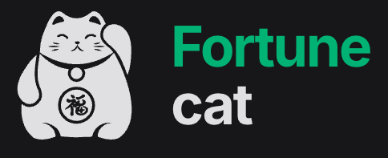

---

**Disclaimer: A aplicação continua em fase de constante desenvolvimento.**

---

O **Fortune Cat** é um gerenciador de finanças pessoais que centraliza o controle do seu dinheiro em um único lugar. Com ele você registra receitas e despesas, acompanha o saldo de contas bancárias e cartões de crédito, e visualiza o fluxo de caixa mensal por meio de gráficos e indicadores.

**Problemas que resolve:**

- **Perda de controle financeiro:** reúne todas as movimentações, contas correntes, poupanças e cartões de crédito em uma visão unificada, eliminando a necessidade de planilhas espalhadas.
- **Dificuldade de rastrear pagamentos parcelados e recorrentes:** ao criar uma transação parcelada ou recorrente, o sistema gera automaticamente todos os registros de pagamento futuros, evitando esquecimentos.
- **Falta de visibilidade sobre onde o dinheiro vai:** a categorização das transações, combinada com gráficos por categoria e forma de pagamento, torna claro o padrão de gastos e receitas.
- **Saldo desatualizado:** ao confirmar ou estornar um pagamento, o saldo da conta ou o limite usado no cartão é atualizado automaticamente, mantendo os números sempre precisos.
- **Dificuldade de análise mensal:** os filtros por período, categoria, carteira e status de pagamento permitem uma análise detalhada de qualquer mês, facilitando o planejamento financeiro.

## Roadmap
- [ ] Misc: Disponibilizar ambiente de demonstração online
- [ ] Test: Implementação de testes automatizados e type coverage
- [ ] Test: Implementar PHPStan ao menos no nível 7
- [ ] Feature: Envio notificações (E-mail) sobre vencimentos próximos
- [ ] Feature: Visualização de projeções baseadas no histórico de transações

---

## Stack
- PHP 8.5
- Laravel 12
- [FilamentPHP](https://filamentphp.com/) (Livewire, TailwindCSS, AlpineJS)
- MySQL

## Executando a aplicação localmente (Aplicação e Banco)
**Docker/Laravel Sail**
- Clone o repositório
- Copie o .env.example para .env e altere as variáveis de ambiente
- Suba os containers com o `docker compose` ou [Sail](https://laravel.com/docs/12.x/sail)
- Dentro do container da aplicação, execute `php artisan key:generate`, `php artisan migrate` e `composer run dev`

## Executando em produção (Apenas a aplicação)
**Docker & FrankenPHP**
- Clone o repositório
- Preencha o `.env` (inclusive `APP_KEY` e `SERVER_NAME`)
- Suba a aplicação com: `docker compose -f compose.prod.yaml build && docker compose -f compose.prod.yaml up -d`

